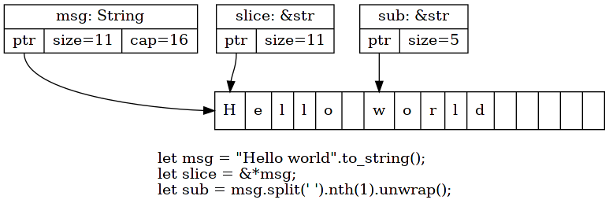

String literals can vary in size as they are the string data that we refer to
```
  let str_literal = "Hello";
```

String objects  have a fixed size in the `stack` that consists of a reference to the string literal in the heap, the capacity of the string literal, and the length of the string literal. When





When we pass a string literal through function 
```
fn print(input_string: String) {
  println!("{}", input_string);
}
```
it will have no idea of the size of the string literal being passed through


We can also get the print function to accept a string literal reference by borrowing it
using the & operator:
```
  fn print(input_string: &str) {
    println!("{}", input_string);
  }
  fn main() {
    let test_string = &"Hello, World!";
    print(test_string);
  }
```

