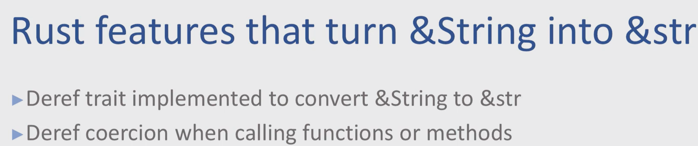

# String vs str

## What is String

```rust
pub struct String {
    vec: Vec<u8>,
}

// Create string from string literal
let s  = String.from("Hello");

```

String has dynamic size and therefore, its size is unknown at compile time

String is `UTF-8` coded, `可变长`的字符串. String 对字符串的内容有 `ownership`

We can always create new, dynamic strings with them and mutate them. But we need to always allocate new memory to create them.


String 实现了

```
  <code>[Deref]<Target = [str]><code>
```

因此继承了 str 的所有方法,可以通过&操作变成&str

String 由 3 部分组成: pointer, length, capacity


The size gives us the length of the string.
The capacity tells us how long it can get before we need to reallocate.
The pointer points to a contiguous char array on the heap of capacity length and size entries in it.

## What is &String
The &String type is a reference to a String. It `isn’t` an owned type and its size is known at compile time because it’s only a pointer to an actual String.

&String is that it can be Deref coerced to &str by the Rust compiler.

```rust
fn main() {
    let s = "hello_world";
    let mut mutable_string = String::from("hello");

    coerce_success(&mutable_string);
    coerce_fail(s);
}

fn coerce_success(data: &str) { // compiles just fine, even though we put in a &String
    println!("{}", data);
}

fn coerce_fail(data: &String) { // error - expected &String, but found &str
    println!("{}", data);
}
```

## &str
&str consists of just a pointer into memory (as well as a size), its size is known at compile time.
The memory can be on the heap, stack, or static directly from the program executable. It’s not an owned type, but rather a read-only reference to a string slice. Rust guarantees that while the &str is in scope, the underlying memory does not change, even across threads.
&String can be coerced to &str, which makes &str a great candidate for function arguments, `if mutability and ownership are not required`.
&str is best used when a slice (view) of a string is needed, which does not need to be changed. However, keep in mind that &str is just a pointer to a str, which has an unknown size at compile time, but is not dynamic in nature, so its capacity can’t be changed.
This is important to know, the memory that the &str points to cannot be changed while the &str is in existence, even by the owner of str.
