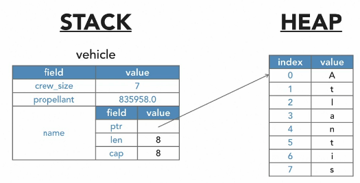

Struct data will be stored on the stack.

## Struct owns the data.
If Struct contains heap based data, like String, 
(String type is a type of struct)

When the struct goes out of scope, the strings heap data will also be dropped.

## Struct with reference data type
Need to annotate the lifetime of the struct to ensure the data it references will be valid for as long as the struct is alive.
