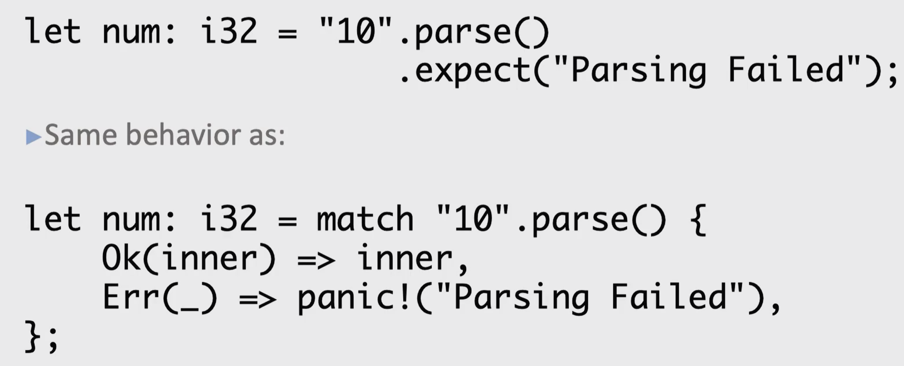

Both `Option` and `Result` type have a method `unwrap()` defined on them.

Unwarp() returns the value inside the Ok variant. Returns a panic! macro of the Err variant

Expect("Error message") returns a value or called the panic! macro with a detailed error message

unwrap and expect calls panic()

expect can send text message to panic

```
fn main() {
    let mut argv = env::args();
    let arg: String = argv.nth(1).unwrap(); // error 1
    let n: i32 = arg.parse().unwrap(); // error 2
    println!("{}", 2 * n);
}
```


