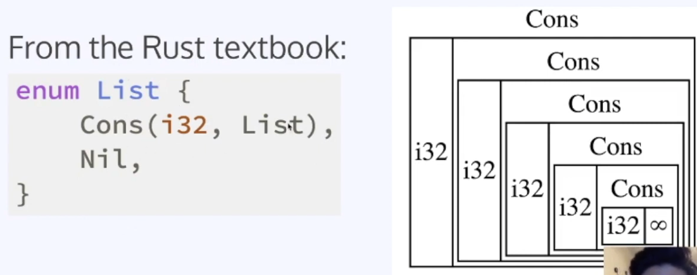

- Rust: Smart Pointers, Linked Lists - CS196 SP20 (2020)
  - https://www.youtube.com/watch?v=2q1AzGUwL7M&ab_channel=CSHonors%40Illinois

Problem: Can NOT decide what the size of Node<T> at compile time

Use Box

Use Option

