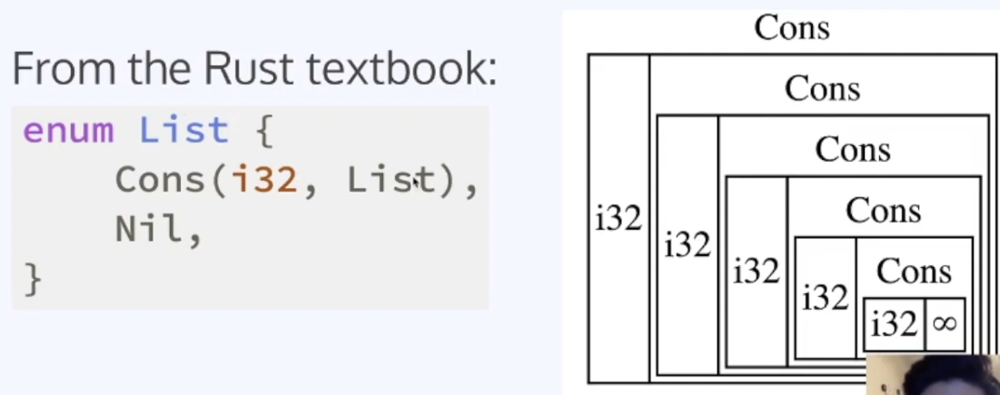
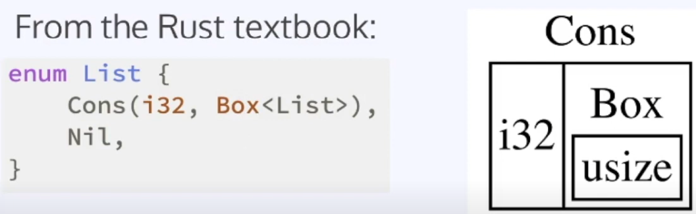
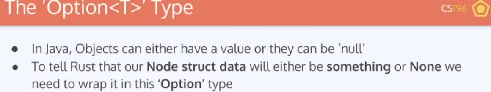

# Resources

https://doc.rust-lang.org/std/collections/struct.LinkedList.html
Struct std::collections::LinkedList

NOTE: It is almost always better to use Vec or VecDeque because array-based containers are generally faster, more memory efficient, and make better use of CPU cache.

- Learn Rust With Entirely Too Many Linked Lists

  - https://rust-unofficial.github.io/too-many-lists/

- https://www.bilibili.com/video/BV1eb4y1Q7FA/

- Rust: Smart Pointers, Linked Lists - CS196 SP20 (2020)
  - https://www.youtube.com/watch?v=2q1AzGUwL7M&ab_channel=CSHonors%40Illinois

Problem: Can NOT decide what the size of Node<T> at compile time

Use Box

Use Option

