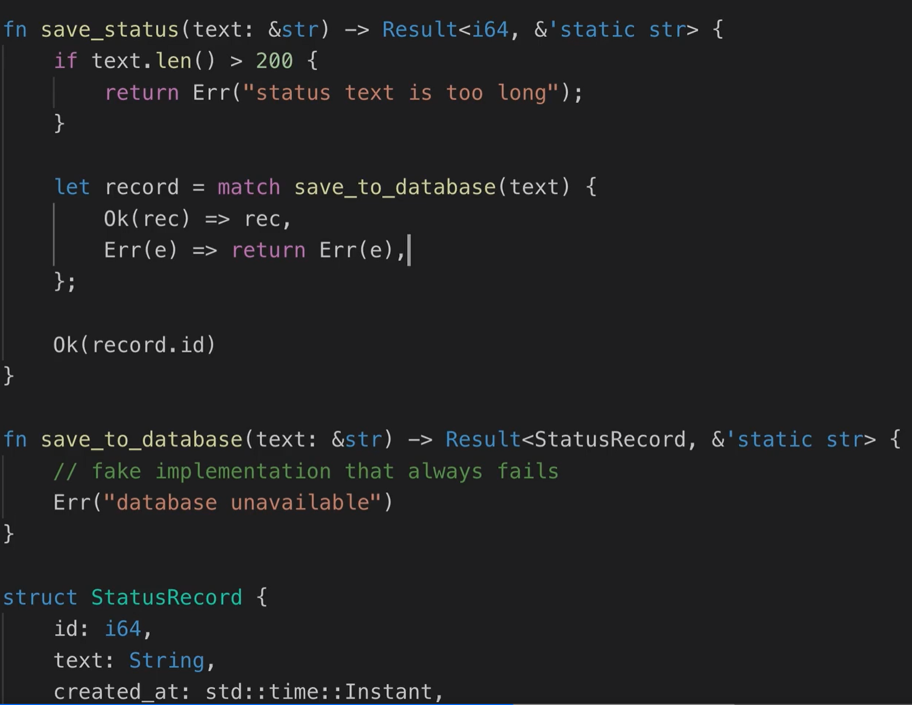
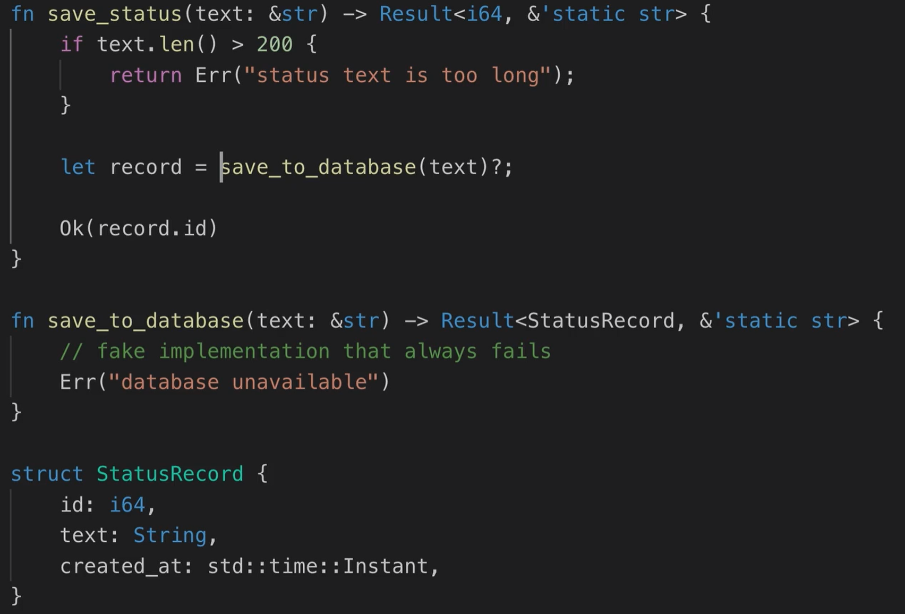

? operator can only be used in a function that returns `Result` or `Option`

```
  let num_read = match reader.read(&mut buffer) {
      Ok(x) => x,
      Err(_)
  }*/   
```

```
  let num_read = reader.read(&mut buffer)?;  
```




Use ?

