# Rust Before Main - Ryan Levick - Rust Linz, July 2022
https://www.youtube.com/watch?v=q8irLfXwaFM


- What happens when we run a Rust binary

- How do we get to the main function

- What is a Rust executable?

- What tools can we use to inspect it

## Prologue: The Rust compilation model
Rustc + LLVM: Rustc is a front end that can interpret and understand rust code and LLVM is the the back end that 
takes Rustc's understanding of your code and turns it into machine code. 
LLVM ultimately produces Object files, these are kind of groups of functions metadata. 

ld(linker on linux) link the object files to exe or binary file


## Smaller bin
```
# Cargo.toml

[profile.release]
strip = true       # remove debugger information, symbols
opt-level = "z"    # optimize size instead of speed
lto = true         # optimize the size when link
panic = "abort"    # changing the way that panics work from unwinding the stack to simply aborting 
```

Get rid of the standard library and customize the panic handler
```
// main.rs

#![no_std]
#![no_main]

#[no_mangle]
pub extern"c fu main() -> isize { 0}

#[panic_handler]
fn my_panic(_info: &core::panic::PanicInfo) -> !{
  loop {}
}
```

## What is inside the bin file
Use hex dump to display the first line in the bin.

Use file tool to find out the file information
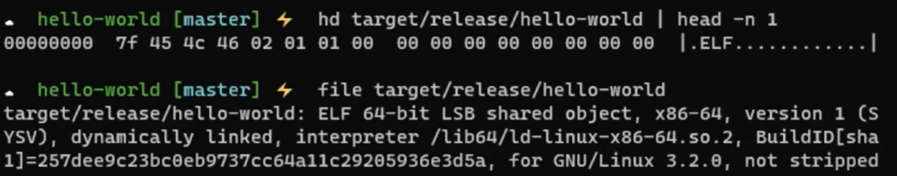

## What is ELF(Executable and Linkable format)
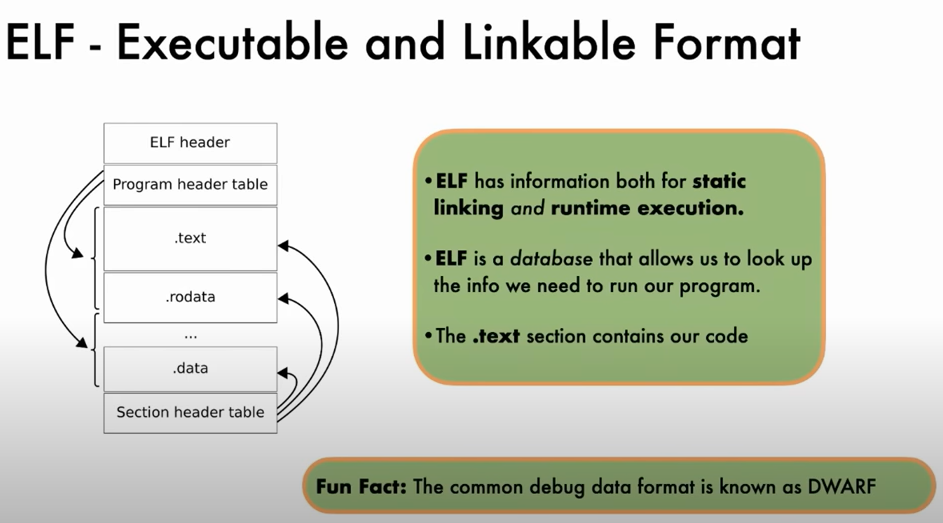

## Where is the code
```
  # disassemble the text inside the bin
  objdump -d hello-world
```
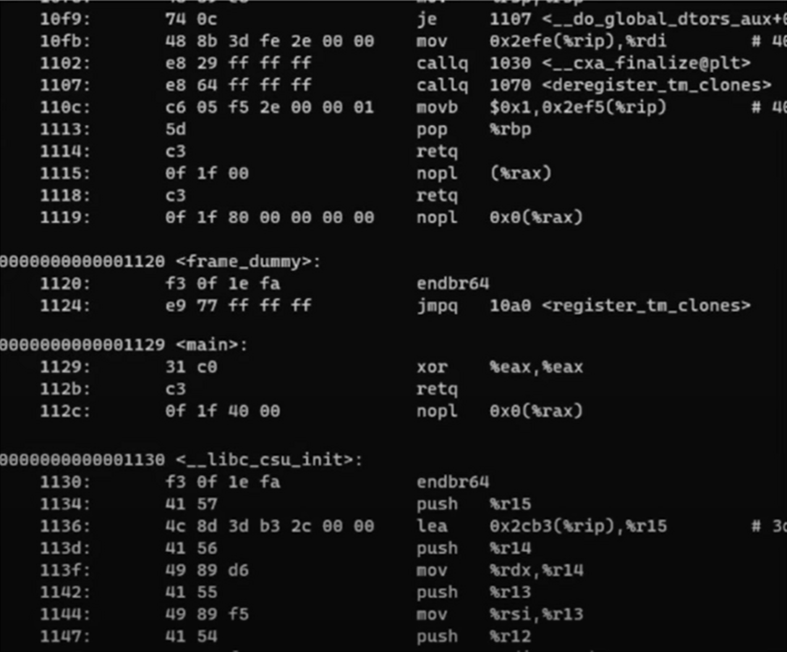

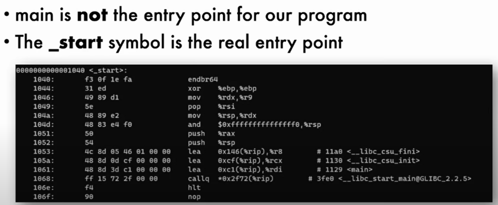

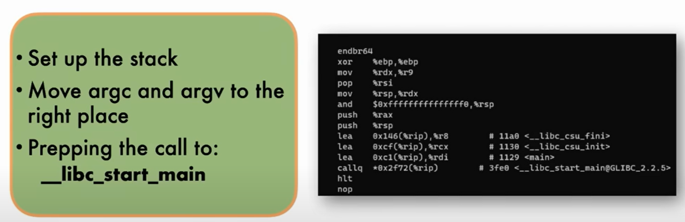

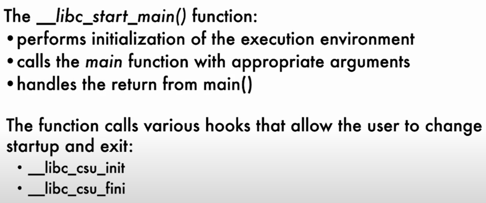

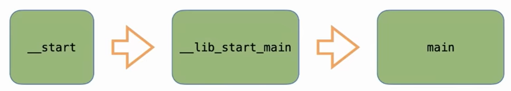

## Find the dependencies
libc a dll is located on your machine
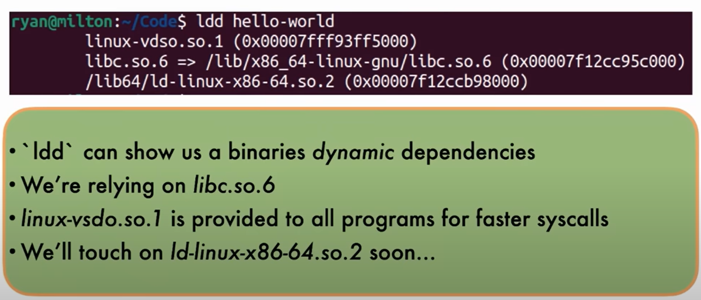


## Find the entry point in Elf header
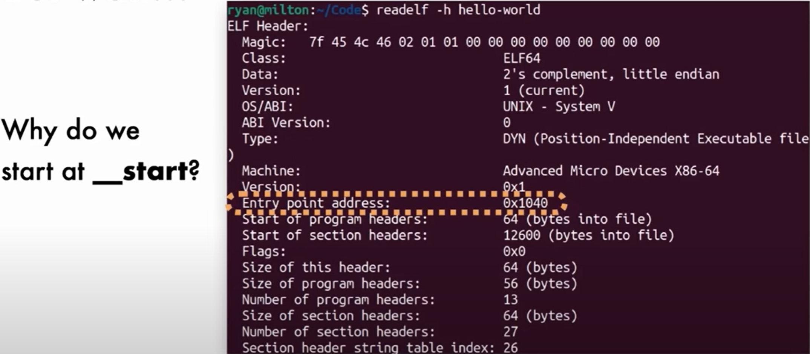

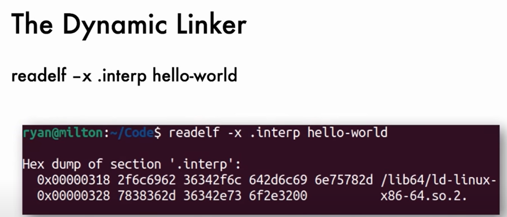

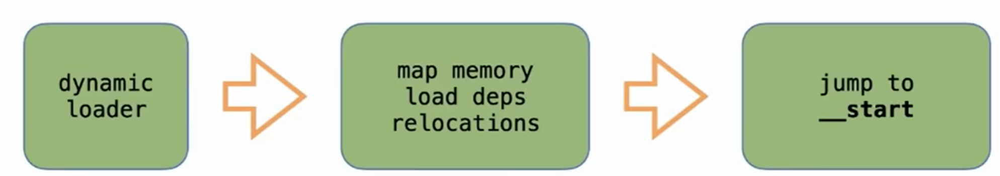


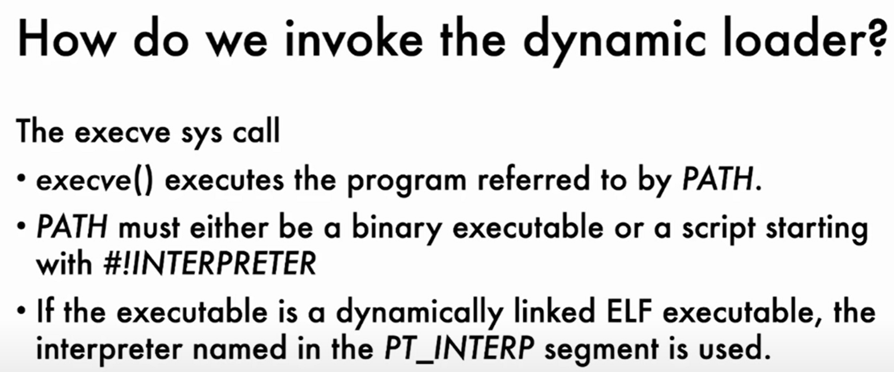
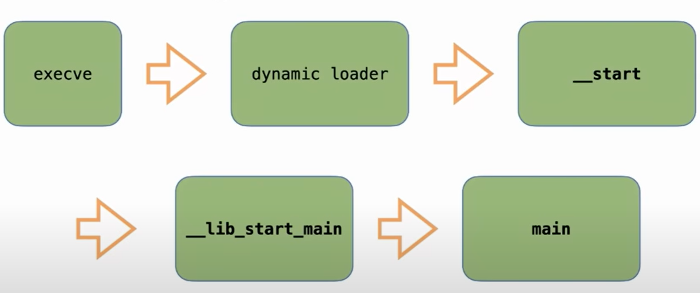


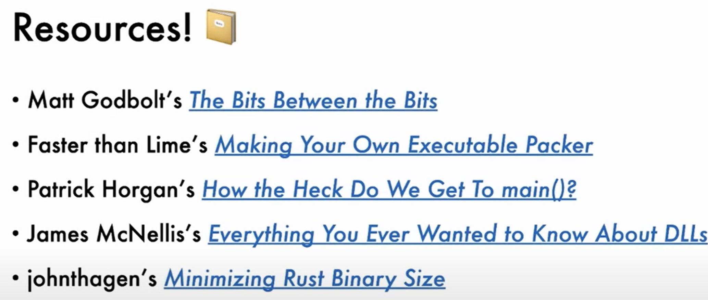